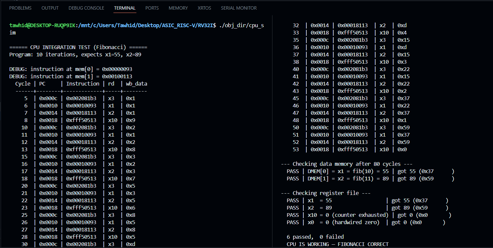
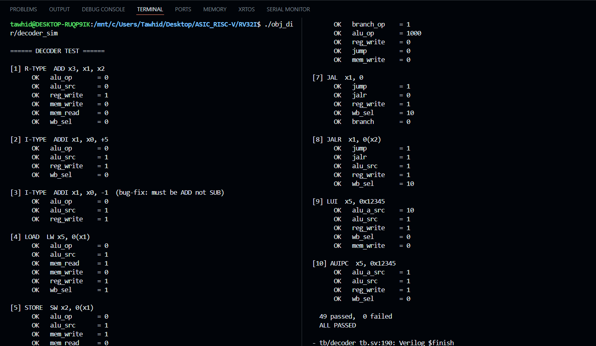
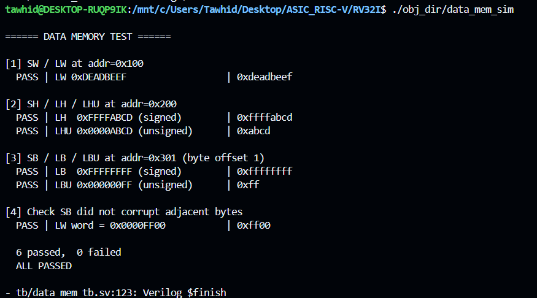
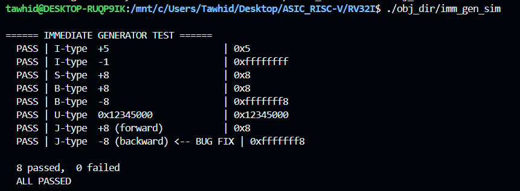

# rv32i-core

A single-cycle **RV32I** processor core implemented from scratch in **SystemVerilog**, simulated with **Verilator** and visualized with **GTKWave**. This is an ongoing project — currently functional enough to run a Fibonacci sequence end-to-end, and being actively developed toward a fully pipelined, FreeRTOS-capable RV32IMC SoC targeting the SKY130 open-source PDK via Tiny Tapeout.

---

## Current State

The core is **functional but partial**. All major datapath and control modules are written, individually verified, and integrated into a working top-level design. The integration is validated by successfully executing a Fibonacci sequence in simulation — computing `fib(10) = 55` and `fib(11) = 89` with correct register file and data memory state after 80 clock cycles.

```
--- Checking data memory after 80 cycles ---
  PASS | DMEM[0] = x1 = fib(10) = 55 | got 55 (0x37)
  PASS | DMEM[1] = x2 = fib(11) = 89 | got 89 (0x59)
--- Checking register file ---
  PASS | x1  = 55                     | got 55 (0x37)
  PASS | x2  = 89                     | got 89 (0x59)
  PASS | x10 = 0 (counter exhausted)  | got 0  (0x0 )
  PASS | x0  = 0 (hardwired zero)     | got 0  (0x0 )
  6 passed, 0 failed
  CPU IS WORKING — FIBONACCI CORRECT
```

Not all instruction types have been exhaustively verified — see [Known Limitations](#known-limitations).

---

## Architecture

Single-cycle, in-order execution. One instruction completes fully — fetch, decode, execute, memory access, writeback — within a single clock cycle. There is no pipeline; no hazard detection is needed at this stage.

```
         ┌─────────────────────────────────────────────────────────────┐
         │                         TOP (cpu_top)                       │
         │                                                             │
  clk ──►│  ┌──────┐   ┌──────┐   ┌─────────┐   ┌─────┐   ┌──────┐     │
  rst ──►│  │  PC  ├──►│ IMEM ├──►│ DECODER ├──►│ ALU ├──►│ DMEM │     │
         │  └──┬───┘   └──────┘   └────┬────┘   └──┬──┘   └──────┘     │
         │     │                        │            │                 │
         │     │       ┌────────┐       │       ┌────┴────┐            │
         │     └──────►│ IMMGEN │       └──────►│ REGFILE │            │
         │             └────────┘               └─────────┘            │
         └─────────────────────────────────────────────────────────────┘
```

---

## Module Breakdown

### `program_counter.sv`
Synchronous program counter. Resets to `0x00000000` on `rst`. Increments by 4 each clock cycle. Branch and jump target overrides are handled in `top.sv`.

### `instruction_mem.sv`
Read-only instruction memory — 1024 words × 32-bit (4 KB). Loaded at simulation start from `program.hex` via `$readmemh`. The address is byte-addressed externally and converted to word-addressed internally by right-shifting by 2.

### `immediate_gen.sv`
Combinational immediate generator. Decodes and sign-extends all six RISC-V immediate formats based on the instruction opcode:

| Format | Instructions         | Bit Extraction                                       |
|--------|----------------------|------------------------------------------------------|
| I-type | ADDI, SLTI, XORI...  | `instr[31:20]`, sign-extended to 32 bits             |
| S-type | SW, SH, SB           | `instr[31:25] \| instr[11:7]`, sign-extended         |
| B-type | BEQ, BNE, BLT...     | Bits scattered across `[31,7,30:25,11:8]`, LSB = 0   |
| U-type | LUI, AUIPC           | `instr[31:12]`, lower 12 bits zeroed                 |
| J-type | JAL                  | Bits scattered across `[31,19:12,20,30:21]`, LSB = 0 |

All 8 test cases pass including positive and negative values for each format. **8 passed, 0 failed.**

> **Bug caught during testing:** J-type backward jumps (negative offset) were initially sign-extended incorrectly. Fixed by correcting the bit ordering in the J-type immediate assembly, particularly the placement of `instr[31]` as the sign bit across 11 positions.

### `register_file.sv`
32 general-purpose 32-bit registers. `x0` is hardwired to zero — writes to `x0` are silently discarded. Reads are asynchronous (combinational). Writes are synchronous (clocked on posedge). Write-enable is gated by the `reg_write` control signal from the decoder.

### `ALU_32bit.sv` + `Full_Adder_32bit.sv`
32-bit ALU with a structurally instantiated ripple-carry adder (`Full_Adder_32bit`) for ADD/SUB operations. The `alu_op` encoding matches the RISC-V `{funct7[5], funct3}` encoding directly, so the decoder can pass the field without remapping.

Supported operations:

| `alu_op` | Operation | Notes                          |
|----------|-----------|--------------------------------|
| `0000`   | ADD       |                                |
| `1000`   | SUB       | Uses adder with `~B + 1`       |
| `0111`   | AND       |                                |
| `0110`   | OR        |                                |
| `0100`   | XOR       |                                |
| `0001`   | SLL       | Shift amount = `B[4:0]`        |
| `0101`   | SRL       | Logical right shift            |
| `1101`   | SRA       | Arithmetic right shift         |
| `0010`   | SLT       | Signed comparison              |
| `0011`   | SLTU      | Unsigned comparison            |

Status flags produced: `zero`, `carry_out`, `overflow`, `negative`.

The ALU was stress-tested independently before top-level integration:

```
ADD (0000):          15 +          10 =          25   ✓
SUB (1000):          25 -          10 =          15   ✓
AND (0111): 1100 & 1010 = 1000                        ✓
OR  (0110): 1100 | 1010 = 1110                        ✓
XOR (0100): 1100 ^ 1010 = 0110                        ✓
SLL (0001): 15 << 2 =          60                     ✓
SLT (0010): -5 < 10 =           1                     ✓
ZERO TEST :          42 -          42 = 0 | Zero: 1   ✓
```

### `decoder.sv`
Combinational control unit. Decodes the 32-bit instruction into all datapath control signals. Supports: `R_TYPE`, `I_TYPE`, `LOAD`, `STORE`, `BRANCH`, `JAL`, `JALR`, `LUI`, `AUIPC`.

| Signal      | Width | Description                                                              |
|-------------|-------|--------------------------------------------------------------------------|
| `alu_op`    | 4-bit | Operation select for ALU                                                 |
| `alu_src`   | 1-bit | ALU B-input: `0` = register, `1` = immediate                             |
| `alu_a_src` | 1-bit | ALU A-input: `0` = register, `1` = PC (used for AUIPC)                   |
| `reg_write` | 1-bit | Enable register file write                                               |
| `mem_write` | 1-bit | Data memory write enable                                                 |
| `mem_read`  | 1-bit | Data memory read enable                                                  |
| `wb_sel`    | 2-bit | Writeback source: `00` = ALU result, `01` = DMEM, `10` = PC+4 (JAL/JALR) |
| `branch`    | 1-bit | Instruction is a branch                                                  |
| `jump`      | 1-bit | Instruction is JAL or JALR                                               |
| `jalr`      | 1-bit | Distinguishes JALR from JAL (target = rs1 + imm, not PC + imm)           |

Independently verified against 10 instruction encodings — **49 signals checked, 49 passed, 0 failed**.

> **Bug caught during testing:** `ADDI x1, x0, -1` was initially decoded with `alu_op = SUB` instead of `ADD`. RISC-V does not have a separate subtract-immediate opcode — negative immediates use the ADD path with a sign-extended negative value. Fixed by correcting the I-type decode logic.

### `data_mem.sv`
Synchronous write, asynchronous read data memory — 1024 words × 32-bit (4 KB). Supports sub-word writes via a 4-bit byte-lane write enable (`we[3:0]`), where each bit controls one byte lane independently. Sub-word reads are handled by masking and sign-extending the output in `top.sv`. Full `SW/LW`, `SH/LH/LHU`, and `SB/LB/LBU` paths are implemented and verified, including an adjacency corruption test confirming that `SB` does not overwrite neighboring bytes.

```
[1] SW / LW  at addr=0x100                    PASS  0xDEADBEEF
[2] SH / LH  / LHU at addr=0x200             PASS  0xFFFFABCD (signed) / 0xABCD (unsigned)
[3] SB / LB  / LBU at addr=0x301 (offset 1)  PASS  0xFFFFFFFF (signed) / 0xFF (unsigned)
[4] SB adjacency — did not corrupt neighbours  PASS  word = 0x0000FF00
6 passed, 0 failed
```

### `top.sv`
Top-level integration module. Connects all submodules and implements control flow logic: PC mux for branches and jumps, branch condition evaluation using ALU flags, writeback mux for `mem_to_reg` and jump-link address (`PC+4`).

---

## Simulation Results

Simulated using **Verilator**. Waveforms captured in `.vcd` format and viewed in **GTKWave**.

### Top-level (Fibonacci end-to-end)


### Decoder


### Data Memory


### Immediate Generator


---

## How to Simulate

### Prerequisites
- [Verilator](https://verilator.org/) (v5.x recommended)
- GTKWave (optional, for waveform viewing)

### Run the top-level Fibonacci test

```bash
# Compile
verilator --cc --exe --build -j 0 --trace \
  src/top.sv src/program_counter.sv src/instruction_mem.sv \
  src/immediate_gen.sv src/register_file.sv src/ALU_32bit.sv \
  src/Full_Adder_32bit.sv src/decoder.sv src/data_mem.sv \
  tb/cpu_top_tb.sv -o cpu_top

# Run
./obj_dir/cpu_top

# View waveforms
gtkwave waves_cpu_top.vcd
```

---

## Known Limitations

These are documented honestly — they are the next things to be fixed, not oversights.

- **LUI / AUIPC not fully verified.** The decoder assigns `alu_op = ADD` and `alu_src = 1` for both, but they require special datapath treatment (`LUI` should bypass the ALU and write the immediate directly; `AUIPC` must add the immediate to the current PC). This handling exists in `top.sv` but has not been independently tested with a dedicated testbench.

- **Branch condition resolution is partially verified.** The decoder correctly sets `branch = 1` and selects the right ALU operation for each branch type (`BEQ/BNE` → SUB, `BLT/BGE` → SLT, `BLTU/BGEU` → SLTU). The final taken/not-taken decision in `top.sv` is exercised by the Fibonacci loop but not all six branch variants have been individually stimulus-tested.

- **SRL and SRA not tested at system level.** Both are implemented in the ALU and pass ALU-unit tests, but no top-level program exercises them.

- **JALR target address.** JAL is used and verified in the Fibonacci program. JALR computes its target via `(rs1 + imm) & ~1` — this is implemented but not independently validated.

- **Sub-word loads not verified at system level.** `LB`, `LH`, `LBU`, `LHU` are fully implemented and pass unit tests in `data_mem.sv` (signed/unsigned masking, sign-extension, adjacency integrity — 6 passed, 0 failed). However, no top-level assembly program currently exercises these paths end-to-end through the full CPU datapath.

- **No CSR, no exceptions, no interrupts.** The core has no `ECALL`, `EBREAK`, `MRET`, or any machine-mode CSR registers. This is expected at this stage.

- **No branch delay slot / pipeline flush needed** — single-cycle architecture makes this a non-issue for now.

---

## Roadmap

This project is the first step in a longer arc toward a complete open-source RISC-V SoC.

### Phase 1 — Single-Cycle RV32I *(current)*
- [x] All major modules written in SystemVerilog
- [x] ALU stress-tested independently
- [x] Top-level integration verified (Fibonacci)
- [ ] Exhaustive per-instruction testbench (all 40 RV32I instructions)
- [ ] Assembly programs: sorting, memory copy, recursive functions

### Phase 2 — 5-Stage Pipeline
- [ ] IF / ID / EX / MEM / WB stage registers
- [ ] Data hazard detection unit
- [ ] Forwarding (EX-EX, MEM-EX)
- [ ] Load-use stall
- [ ] Branch prediction (static not-taken to start)
- [ ] Pipeline flush on taken branch

### Phase 3 — RV32IMC Extension
- [ ] **M extension**: hardware multiply (`MUL`, `MULH`) and divide (`DIV`, `DIVU`, `REM`)
- [ ] **C extension**: 16-bit compressed instruction decode

### Phase 4 — SoC Integration
- [ ] On-chip SRAM (OpenRAM)
- [ ] Boot ROM
- [ ] UART (for bootloader and debug output)
- [ ] SPI master
- [ ] Timer with interrupt
- [ ] JTAG debug interface (PULP debug module)
- [ ] FreeRTOS port and UART bootloader

### Phase 5 — Silicon
- [ ] RTL-to-GDSII flow using OpenLane 2
- [ ] Target: SKY130 130nm via [Tiny Tapeout](https://tinytapeout.com/)
- [ ] Post-layout simulation and timing sign-off
- [ ] Chip characterization and measurement

---

## Project Context

This core is being built as part of a self-directed study in digital hardware and computer architecture, running in parallel with a degree in Industrial Engineering. The longer-term goal is to use this project as the foundation for graduate research in VLSI and computer architecture, with a hardware accelerator for IE-domain applications (supply chain optimization, predictive maintenance) as the target research contribution.

The learning sequence followed: Mano (Digital Design) → Harris & Harris (RISC-V Ed.) → Patterson & Hennessy (RISC-V Ed.) → Hennessy & Patterson (Computer Architecture: A Quantitative Approach) → Weste & Harris (CMOS VLSI Design).

---

## Tools

| Tool         | Purpose                          |
|--------------|----------------------------------|
| SystemVerilog| RTL implementation language      |
| Verilator    | Simulation (cycle-accurate)      |
| GTKWave      | Waveform viewer (`.vcd`)         |
| WSL (Ubuntu) | Development environment          |

---

## References

- [RISC-V ISA Specification](https://riscv.org/technical/specifications/)
- [Digital Design and Computer Architecture: RISC-V Edition — Harris & Harris](https://www.elsevier.com/books/digital-design-and-computer-architecture/harris/978-0-12-820064-3)
- [Nandland — SystemVerilog tutorials](https://www.nandland.com/)
- [HDLBits — Verilog practice problems](https://hdlbits.01xz.net/)
- [OpenLane 2](https://openlane2.readthedocs.io/)
- [Tiny Tapeout](https://tinytapeout.com/)

---

## License

MIT
